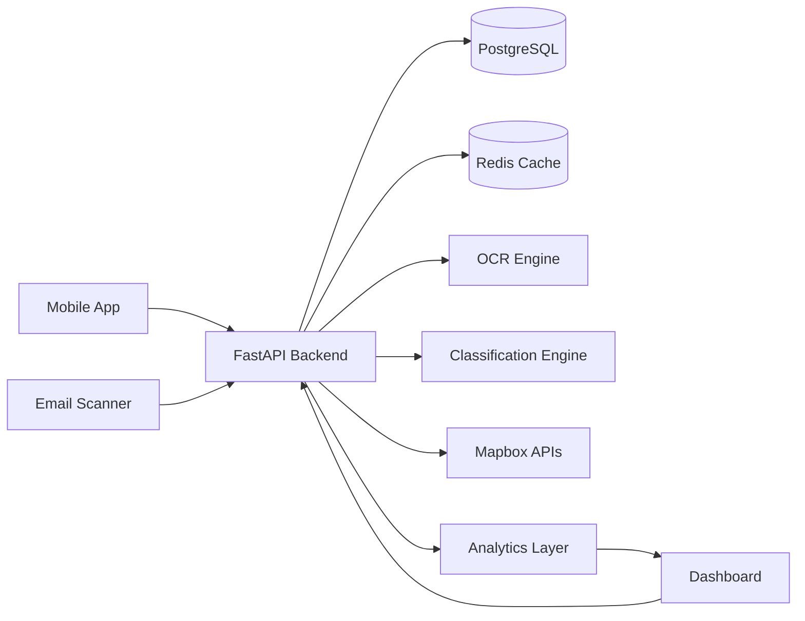

# 🚀 Hackathon Receipt Helper v2.0

<div align="center">

# AI-Powered Expense Intelligence Platform

### Transforming receipts into actionable financial intelligence with OCR, AI classification, email ingestion, geo-spatial analytics, and real-time dashboards.

<p align="center">
  
</p>

<p align="center">
  
  
  
  
  
  
</p>

<p align="center">
  <a href="#-overview">Overview</a> •
  <a href="#-core-features">Features</a> •
  <a href="#-architecture">Architecture</a> •
  <a href="#-tech-stack">Tech Stack</a> •
  <a href="#-api-reference">API</a> •
  <a href="#-deployment">Deployment</a>
</p>

</div>

---

# 🌍 Overview

**Hackathon Receipt Helper v2.0** is a modern AI-powered expense intelligence platform built for the next generation of personal finance and smart bookkeeping.

The platform combines:

* 🧠 AI OCR receipt understanding
* 📧 Email-based invoice ingestion
* 📍 Map-based spending analytics
* 📊 Enterprise-grade dashboards
* ⚡ Real-time financial visualization
* 🔐 Secure multi-service architecture
* 🐳 Production-ready Docker deployment

This project demonstrates how modern AI infrastructure can transform raw receipts into structured financial insights.

---

# ✨ Product Vision

> "Every receipt tells a story. We built the infrastructure to understand it."

Hackathon Receipt Helper is designed as a lightweight but scalable financial intelligence system.

Instead of manually categorizing expenses, users simply:

1. Upload receipts
2. Forward invoice emails
3. Let AI extract + classify data
4. Explore spending insights visually

The result is a frictionless financial management experience.

---

# 🧠 Core Features

## 📸 AI Receipt OCR

Extract structured financial data from:

* Paper receipts
* Screenshots
* PDF invoices
* Mobile camera uploads

Supported extraction fields:

| Field    | Description                 |
| -------- | --------------------------- |
| Merchant | Store / vendor detection    |
| Amount   | Total transaction value     |
| Currency | Multi-currency support      |
| Tax      | VAT / GST extraction        |
| Date     | Smart transaction parsing   |
| Category | AI-generated classification |
| Location | Geocoded spending data      |

---

## 🤖 Intelligent Classification Engine

The platform continuously improves spending categorization using:

* AI inference
* Historical learning
* User correction feedback
* Pattern recognition

Example categories:

* Food & Dining
* Transportation
* SaaS & Subscriptions
* Travel
* Shopping
* Utilities
* Healthcare

---

## 📧 Email Invoice Scanner

Automatically scan invoice emails and convert them into structured transactions.

### Supported Workflows

* Gmail invoice sync
* PDF attachment ingestion
* Auto expense parsing
* Vendor recognition
* Duplicate prevention

---

## 🗺️ Mapbox Spending Intelligence

Visualize expenses geographically.

Users can:

* View spending heatmaps
* Analyze spending by city
* Track travel expenses
* Discover location-based patterns

<p align="center">
  
</p>

---

## 📊 Executive Dashboard

A modern analytics dashboard powered by:

* Recharts
* Nivo
* Mapbox GL JS

Features:

* Expense trend analysis
* Category breakdowns
* Time-series analytics
* Financial forecasting foundations
* Real-time KPI panels

<p align="center">
  
</p>

---

# 🏗️ System Architecture



---

# ⚡ Technology Stack

## Backend

| Technology | Purpose                        |
| ---------- | ------------------------------ |
| FastAPI    | High-performance API framework |
| PostgreSQL | Persistent relational database |
| Alembic    | Database migrations            |
| Redis      | Caching & async processing     |
| Python     | Core business logic            |

---

## Frontend

| Technology    | Purpose               |
| ------------- | --------------------- |
| React 19      | Modern UI framework   |
| Vite          | Fast frontend tooling |
| TailwindCSS 4 | Design system         |
| Recharts      | Interactive charts    |
| Nivo          | Data visualization    |
| Mapbox GL JS  | Geo analytics         |

---

## Infrastructure

| Technology     | Purpose                     |
| -------------- | --------------------------- |
| Docker         | Containerized deployment    |
| Docker Compose | Multi-service orchestration |
| VPS Ready      | Production hosting          |
| SSL Support    | Secure deployment           |

---

# 📱 Product Screens

## Mobile Receipt Capture

<p align="center">
  
</p>

---

## AI Parsing Workflow

<p align="center">
  
</p>

---

## Analytics Experience

<p align="center">
  
</p>

---

# 🔌 API Reference

## Authentication

```http
POST /api/auth/login
```

### Request

```json
{
  "username": "admin",
  "password": "CHANGE_THIS_PASSWORD"
}
```

---

## Upload Receipt

```http
POST /api/receipts/upload
```

### Multipart Form

| Field    | Type        |
| -------- | ----------- |
| file     | Image / PDF |
| category | Optional    |
| notes    | Optional    |

### Response

```json
{
  "merchant": "Starbucks",
  "amount": 8.99,
  "currency": "USD",
  "category": "Food & Dining",
  "confidence": 0.98
}
```

---

## Fetch Dashboard Analytics

```http
GET /api/dashboard/overview
```

### Example Response

```json
{
  "monthly_spending": 2450,
  "top_category": "Food",
  "receipt_count": 182,
  "cities": 12
}
```

---

## Email Sync

```http
POST /api/email/sync
```

---

# 🚀 Quick Start

## 1. Clone Repository

```bash
git clone https://github.com/bkcsplayers/hackathon-receipts.git
cd hackathon-receipts
```

---

## 2. Configure Environment

```bash
cp .env.example .env
```

Edit environment variables:

```env
DATABASE_URL=
REDIS_URL=
MAPBOX_TOKEN=
JWT_SECRET=
OCR_API_KEY=
```

---

## 3. Start Containers

```bash
docker compose up -d --build
```

---

## 4. Run Migrations

```bash
docker compose exec api alembic upgrade head
```

---

## 5. Seed Database

```bash
docker compose exec api python seed.py
```

---

# 🌐 Local Services

| Service      | URL                                                      |
| ------------ | -------------------------------------------------------- |
| Mobile       | [http://localhost:4511](http://localhost:4511)           |
| Dashboard    | [http://localhost:4512](http://localhost:4512)           |
| API          | [http://localhost:4510](http://localhost:4510)           |
| Swagger Docs | [http://localhost:4510/docs](http://localhost:4510/docs) |
| PostgreSQL   | localhost:4513                                           |
| Redis        | localhost:4514                                           |

---

# 🐳 Production Deployment

## Production Compose

```bash
docker compose -f docker-compose.prod.yml up -d --build
```

---

## SSL + VPS

The system is designed for:

* Ubuntu VPS
* Nginx reverse proxy
* HTTPS SSL
* Cloud deployment
* Horizontal scaling

Deployment documentation:

```bash
docs/12-deployment.md
```

---

# 🔐 Security Considerations

## Included

* JWT authentication
* Environment-based secrets
* Secure container isolation
* Database migration versioning
* API documentation isolation

## Recommended

* Rate limiting
* Object storage encryption
* WAF integration
* Audit logging
* SSO support

---

# 📈 Scalability Strategy

Designed to evolve into:

* Multi-tenant SaaS
* Enterprise finance assistant
* AI bookkeeping platform
* Autonomous accounting workflows

Potential future integrations:

* Stripe
* Plaid
* QuickBooks
* Xero
* OpenAI Agents
* Google Workspace

---

# 🧩 Project Structure

```bash
.
├── api/
├── mobile/
├── dashboard/
├── docs/
├── docker-compose.yml
├── docker-compose.prod.yml
├── seed.py
└── README.md
```

---

# 🎨 Design Philosophy

The interface was inspired by:

* Apple Wallet
* Linear
* Stripe Dashboard
* Notion analytics systems
* Modern fintech SaaS products

Goals:

* Minimal cognitive load
* Fast data visibility
* Enterprise clarity
* Mobile-first workflows

---

# 📊 Why This Project Matters

Financial data is fragmented.

Receipts exist across:

* Email inboxes
* Wallets
* Photos
* PDFs
* SaaS subscriptions

Hackathon Receipt Helper centralizes and structures that data into a unified intelligence layer.

This project demonstrates how:

* AI
* OCR
* Geospatial systems
* Realtime analytics
* Modern frontend architecture

can work together to build the future of financial infrastructure.

---

# 🛣️ Future Roadmap

## AI Layer

* LLM-powered financial assistant
* Natural language expense queries
* Autonomous bookkeeping
* AI budgeting recommendations

## Mobile Experience

* Native iOS app
* Offline receipt scanning
* Smart push notifications

## Enterprise

* Team workspaces
* Approval workflows
* Audit systems
* Expense policies

---

# 🧪 Example Use Cases

| Use Case                   | Description              |
| -------------------------- | ------------------------ |
| Personal Finance           | Smart expense tracking   |
| Freelancer Accounting      | Automated bookkeeping    |
| Startup Finance Ops        | Team spending visibility |
| Travel Expense Management  | Geo-tagged receipts      |
| SaaS Subscription Tracking | Email invoice parsing    |

---

# 🏆 Highlights

✅ AI OCR Receipt Parsing
✅ Intelligent Expense Classification
✅ Email Invoice Automation
✅ Geospatial Spending Analytics
✅ Modern React 19 Frontend
✅ FastAPI Backend Architecture
✅ Dockerized Production Setup
✅ Enterprise Dashboard Experience

---

# 📜 License

MIT License

---

# 🤝 Contributing

Contributions are welcome.

```bash
fork → branch → commit → pull request
```

---

# 💡 Final Thoughts

Hackathon Receipt Helper v2.0 is more than a receipt scanner.

It is a foundation for AI-native financial infrastructure.

A system where:

* every transaction becomes searchable,
* every receipt becomes structured,
* and every expense becomes intelligent.

---

<div align="center">

### Built with precision, scalability, and modern AI architecture.

<p align="center">
  
</p>

**Hackathon Receipt Helper v2.0**

*Financial Intelligence, Reimagined.*

</div>
